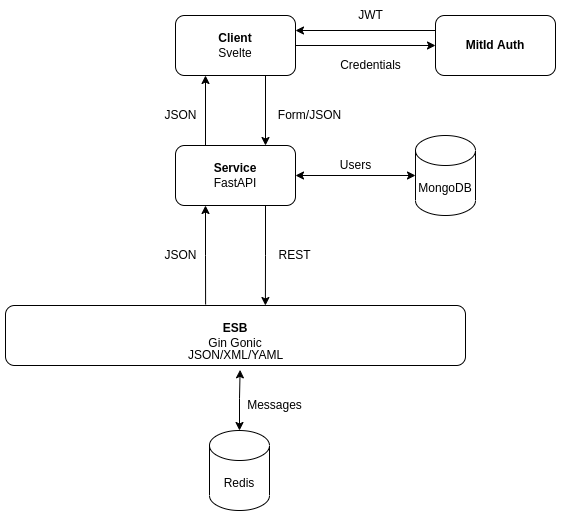

# System Integration

---

# Architecture

---

# Concept

---

# Demo

---

# ESB

- Motivation
  - Decoupling of clients from services
  - Data transformation/Conversion between transport protocols
  - Routing between services
- Implementation
  - Indsæt billeder fra ESB-kode her

---

# Microservices

- Containerization
  - Discoverability
    - Docker Networks
- Scalability
- Database per Service
- Deployment
  - Serverless frontend
- API Gateway

---

# Security

- Access Token
  - JWT

---

Dependency Injection

---

# Stubbing and Drivers

---
