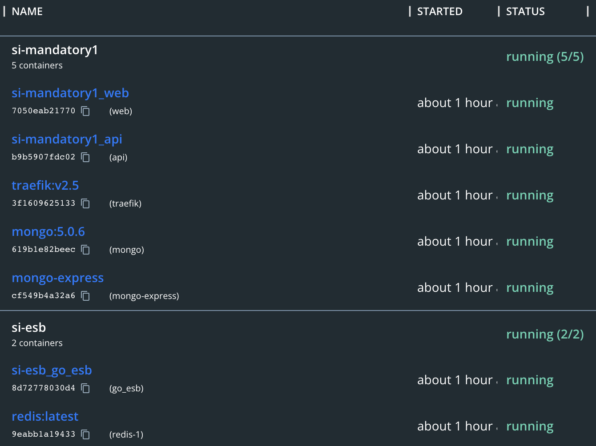

# System Integration

---

# Architecture

---

# Concept

---

<video controls>
  <source src="static/si-demo.mp4" type="video/mp4">
</video>

---

# ESB

- Motivation
  - Decoupling of clients from services
  - Data transformation/conversion
  - Routing between services

---

# Code

---
# Code

---

# Driver

Hoppscotch/Postman

- https://hoppscotch.io/

---

- Pros
  - Centralized integration makes for easier development of services
  - Many transport protocols can be supported at once
  - Keeps you from implementing all of your protocols in every service

---

- Cons
  - Single point of failure
  - ESB becomes a monolith and difficult to maintain

- Alternatives
  - Smart endpoints and dumb pipes

---

# Microservices

---

# Hosted

- Vercel:
  - Frontend
    - https://si-mandatory1.vercel.app/

- Hetzner:
  - Backend
    - http://python.si.streamchaser.tv/docs
  - ESB
    - http://78.46.225.191:9999/

---

# Security

- Access Token
  - JWT

---

Dependency Injection

---
